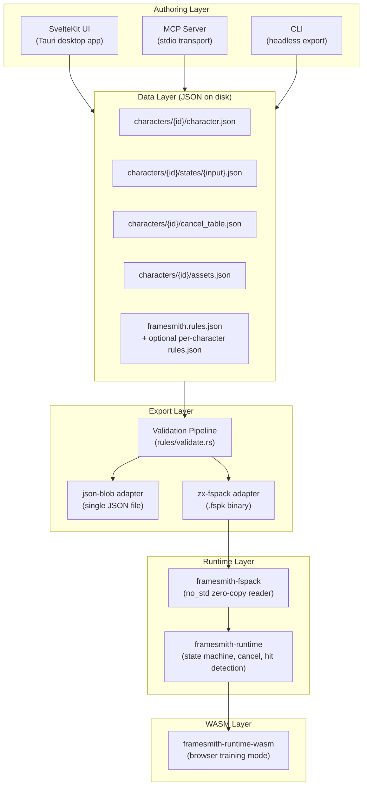
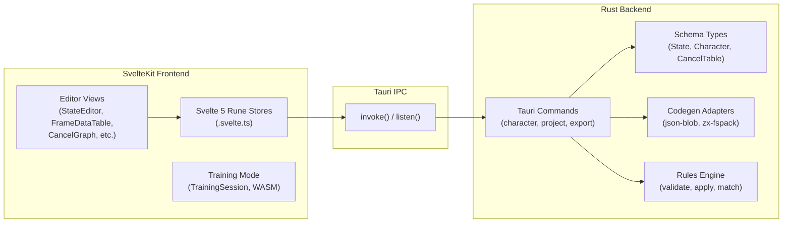

# Framesmith Architecture

**Status:** Active
**Last reviewed:** 2026-02-20

This document describes Framesmith's system architecture, the data pipeline from authoring to runtime, and the responsibility boundaries between layers.

## Data Pipeline

## Tauri IPC Bridge

## Layer Responsibilities

### Authoring layer

Three entry points create and modify character data: the SvelteKit desktop UI (primary), the MCP server (AI/LLM integration via stdio), and the CLI (headless automation). All three write to the same on-disk JSON files and use the same shared validation pipeline. The UI runs inside a Tauri shell and communicates with the Rust backend over IPC; the MCP server and CLI are standalone Rust binaries that operate directly on the filesystem.

### Data layer

Character data lives on disk as a directory of JSON files. Each character has its own folder under `characters/` containing `character.json` (identity and properties), `cancel_table.json` (cancel relationships), `assets.json` (animation/model references), and one file per state in `states/`. A project-level `framesmith.rules.json` defines defaults and validation rules; characters can optionally override with their own `rules.json`. The canonical Rust types for all data structures are in `src-tauri/src/schema/mod.rs`.

### Export layer

The export pipeline reads JSON files, applies rule defaults, runs the shared validation pipeline (`rules/validate.rs`), and produces output through one of two adapters. The `json-blob` adapter emits a single resolved JSON file. The `zx-fspack` adapter emits a compact `.fspk` binary using fixed-size records for zero-copy deserialization. Both adapters are invoked identically from the UI, CLI, and MCP server -- validation is never bypassed.

### Runtime layer

`framesmith-fspack` is a `no_std` crate that provides zero-copy views over `.fspk` binary data. `framesmith-runtime` builds on it to implement the core simulation: frame-by-frame state advancement, cancel validation (explicit chains, tag-based rules, deny lists), hit detection (AABB hitbox/hurtbox overlap), and resource management. The runtime is stateless and deterministic -- `CharacterState` is 22 bytes, `Copy`, and designed for rollback netcode.

### WASM layer

`framesmith-runtime-wasm` wraps the runtime crate as a WebAssembly module for browser use. It powers the training mode in the editor, where users can test characters in real time with hitbox visualization. The WASM module is loaded by the SvelteKit frontend and driven by `TrainingSession` in `src/lib/training/`.

## Key Design Decisions

- **One file per state.** States are stored as individual JSON files (`states/<input>.json`) rather than a monolithic array. This enables clean diffs, parallel editing, and simple MCP operations.

- **Shared validation.** UI save, CLI export, and MCP server all run through `rules/validate.rs`. There is exactly one validation path.

- **FSPK is fixed-size records.** The binary format uses fixed-size records exclusively for zero-copy deserialization. Variable-length encodings (MessagePack, JSON) are not used in FSPK sections.

- **Variant inheritance is authoring-only.** The `base` field on states enables inheritance during editing, but variants are fully resolved (flattened) at export time. The runtime never sees inheritance.

- **Nested properties are flattened.** `Object` and `Array` values in `PropertyValue` are flattened to dot-path keys at export (e.g., `movement.distance`). The binary format contains only flat key-value pairs.

## See Also

- [Data Formats](data-formats.md) -- on-disk JSON schema (SSOT)
- [Rules Spec](rules-spec.md) -- validation and defaults system (SSOT)
- [ZX FSPK Format](zx-fspack.md) -- binary pack format details
- [Runtime Guide](runtime-guide.md) -- runtime integration patterns
- [MCP Server](mcp-server.md) -- AI/LLM tool integration
- [CLI](cli.md) -- headless export commands
